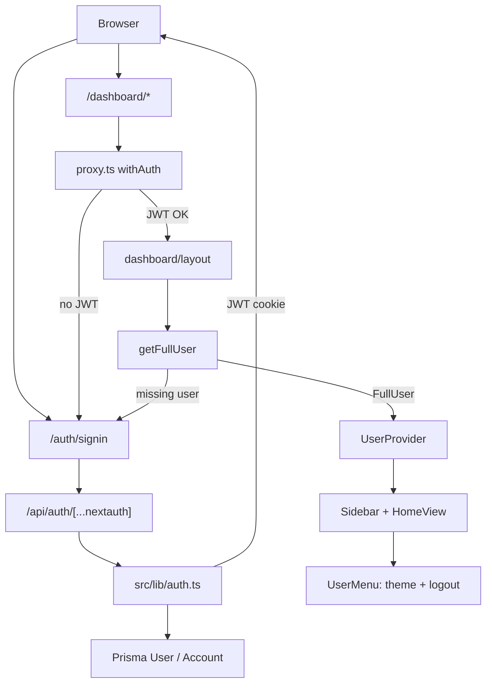

# NextAuth authentication

High-level overview of auth in this template.

## Overview

Invite-only auth with **NextAuth v4**:

- Credentials (email/password) and Google OAuth.
- JWT sessions (no DB session tables).
- Prisma `User` / `Account` for identity and linked providers.

No public registration. Users must already exist (usually via seed). Google
only works if that email already has a `User` row.

## Design choices

| Choice                           | Reason                                                         |
| -------------------------------- | -------------------------------------------------------------- |
| NextAuth v4                      | Stable                                                         |
| JWT                              | Simple sessions without `Session` / `VerificationToken` tables |
| Invite-only                      | Closed access by default                                       |
| `UserProvider` over `useSession` | Server loads the DB user; client gets typed context            |

## Flow

Sign-in goes through `/api/auth/[...nextauth]` (`src/lib/auth.ts`) and redirects to the dashboard if successful.

Some relevant details:

- **Dashboard routes:** are protected at the edge (`proxy.ts`) and again in the layout.
- **Credentials:** validate against `User.password` using bcrypt.
- **Google:** allow only if the user exists, link `Account` if missing,
otherwise `AccessDenied`.
- **Identity in app code:** use `getUser` / `getFullUser` on the server and
`useUser()` on the client — not `SessionProvider` / `useSession`.
- **Errors:**
  - Bad credentials stay on the sign-in form.
  - Denied Google and NextAuth failures go to `/error?error=…`.

## Considerations

- **Extending:**
  - Add users via seed data (see `scripts/seed/data/user.ts`)
  - Extend `FullUser` when you need more dashboard context.
  - Widen `proxy.ts` matcher for more private routes.
