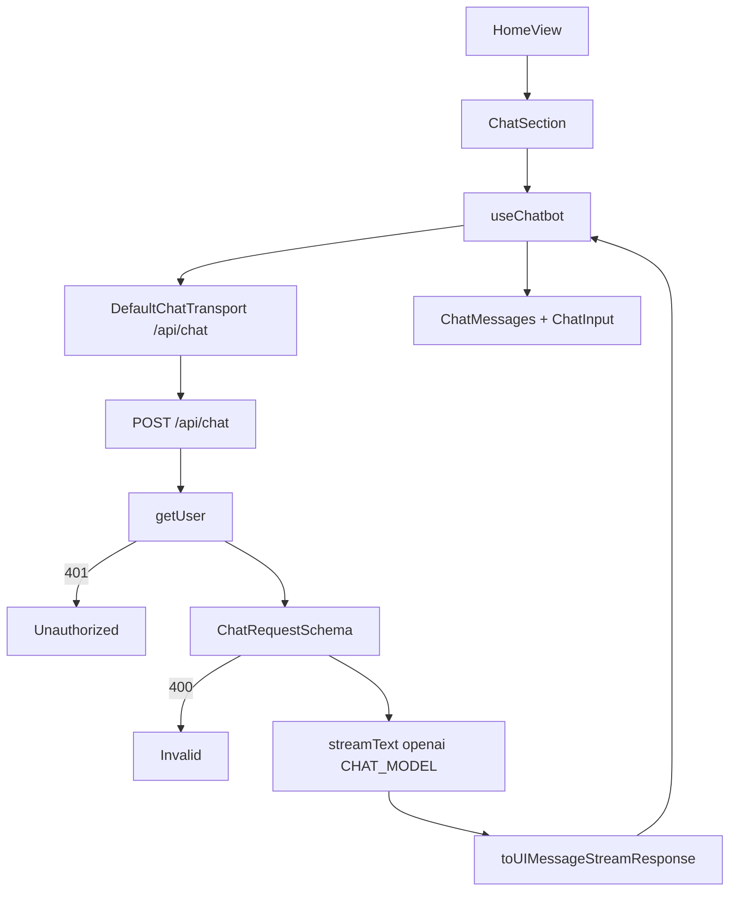

# Chatbot

High-level overview of the dashboard Q&A chatbot in this template.

## Overview

Streaming chat on the dashboard home page for **JavaScript, TypeScript,
Node.js, and Next.js** questions:

- OpenAI via `@ai-sdk/openai` and the Vercel AI SDK (no AI Gateway).

## Design choices

| Choice                         | Reason                                                      |
| ------------------------------ | ----------------------------------------------------------- |
| Direct `@ai-sdk/openai`        | Single `OPENAI_API_KEY`; no Gateway routing                 |
| Model knowledge only (for now) | Ship Q&A first; tools / AppDB grounding come later          |

## Defaults

| Constant             | Value                                              |
| -------------------- | -------------------------------------------------- |
| `CHAT_MODEL`         | `gpt-4.1-mini`                                     |
| `CHAT_SYSTEM_PROMPT` | JS/TS/Node/Next only; concise; refuse out of scope |

## Flow

Chat mounts from `HomeView` → `ChatSection`. The client streams through
`/api/chat` (`src/app/api/chat/route.ts`).

Some relevant details:

- **Auth:** Dashboard is gated; the route still returns `401` without a
  session.
- **`useChatbot`:** wraps `useChat` and stamps message metadata
  (`timestamp`, assistant `durationMs`).
- **Input:** Enter sends; Shift+Enter inserts a newline.
- **Errors:** Soft danger `Alert` shows the client error message.
- **`client-debug`:** Seeds `initialMessages` from
  `scripts/seed/data/chat-session.js`, logs section state, and shows
  non-text **Steps** under assistant bubbles.
- **`server-debug`:** Logs chat input and `streamText` `onEnd` output in
  the API route.
- **Env:** `OPENAI_API_KEY` in `envs.ts` / `.env.example`;
  required at runtime to chat (SDK reads it by default).

## Considerations

- **Extending:**
  - Keep request shape in `ChatRequestSchema` and metadata on
    `ChatUIMessage`.
  - Add tools or AppDB grounding in a later feature.
  - Debug fixtures live under `scripts/seed/data/` (for example
    `chat-session.js`, `chat-request.json`).
