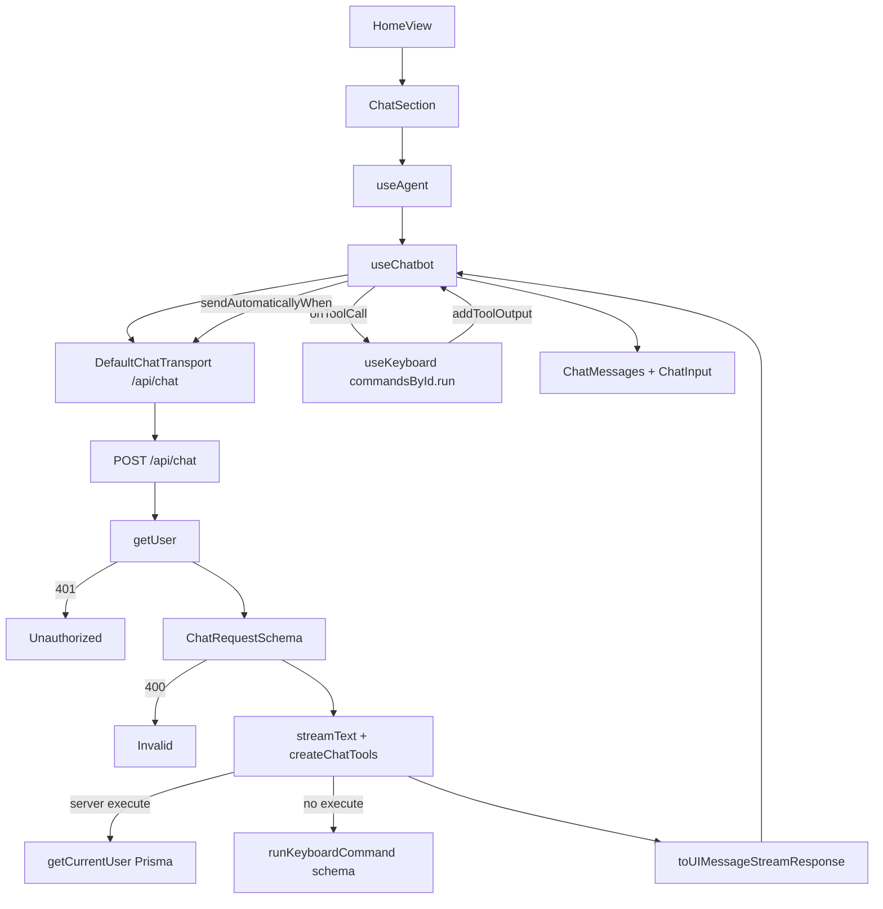
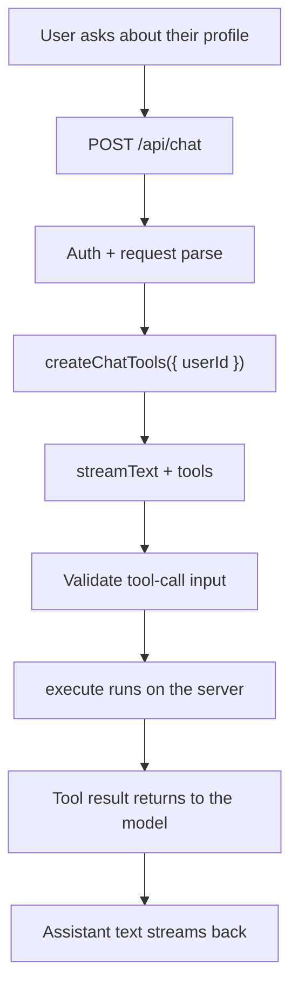
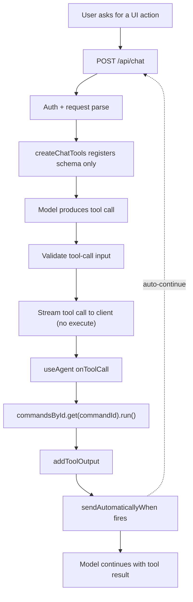

# Chatbot

High-level overview of the dashboard Q&A chatbot in this template.

## Overview

Streaming chat on the dashboard home page for **JavaScript, TypeScript,
Node.js, and Next.js**, plus **App/DB** answers and **UI keyboard
commands** via tools:

- OpenAI via `@ai-sdk/openai` and the Vercel AI SDK (no AI Gateway).

### Defaults

| Constant             | Value                                                        |
| -------------------- | ------------------------------------------------------------ |
| `CHAT_MODEL`         | `gpt-4o-mini`                                                |
| `CHAT_SYSTEM_PROMPT` | JS/TS/Node/Next + App/DB + UI commands; concise; refuse else |

### Tools

| Tool                 | Where  | Behavior                                              |
| -------------------- | ------ | ----------------------------------------------------- |
| `getCurrentUser`     | Server | Prisma profile for closed-over session `userId`       |
| `runKeyboardCommand` | Client | Schema only on server; `onToolCall` runs via keyboard |

## Design choices

| Choice                           | Reason                                                      |
| -------------------------------- | ----------------------------------------------------------- |
| Direct `@ai-sdk/openai`          | Single `OPENAI_API_KEY`; no Gateway routing                 |
| Session-scoped tools             | Never trust client-supplied user ids                        |
| Client keyboard tool             | UI commands must run in the browser via `useKeyboard`       |
| Client-sent `keyboardCommandIds` | Tool enum = registry ids with `run`; server allowlists them |

## Flow

Chat mounts from `HomeView` → `ChatSection` → `useAgent` →
`useChatbot` → `/api/chat`.

Some relevant details:

- **Auth:** Dashboard is gated; the route still returns `401` without a
  session.
- **Errors:** Request parse failures and stream errors are logged;
  soft danger `Alert` shows the client error message. Tool failures use
  `addToolOutput({ state: "output-error", errorText })`.
- **`useChatbot`:** wraps `useChat` and stamps message metadata
  (`timestamp`, assistant `durationMs`).
- **`useAgent`:** feature hook; skips dynamic tools; sends
  `keyboardCommandIds` from `useKeyboard().commandsById`; runs
  `runKeyboardCommand` on the client; does not await `addToolOutput`.
- **Agent loop:** `stopWhen: stepCountIs(5)`, `maxRetries: 2`,
  `temperature: 0.2`, `repairToolCall` (re-ask; no `Output.object`).
- **Input:** Enter sends; Shift+Enter inserts a newline.
- **`client-debug`:** Seeds `initialMessages` from
  `scripts/seed/data/chat-session.js`, logs section state, and shows
  non-text **Steps** under assistant bubbles.
- **`server-debug`:** Logs chat input and `streamText` `onEnd` output in
  the API route.
- **`user-message-markdown`:** When on, user bubbles render via
  `MessageMarkdown`; when off, user text is plain
  `whitespace-pre-wrap`.
- **Env:** `OPENAI_API_KEY` in `envs.ts` / `.env.example`;
  required at runtime to chat (SDK reads it by default).

### Server tool (`getCurrentUser`)

Runs on the server via `execute` inside one `streamText` loop — no
client `onToolCall` or auto-POST. `inputSchema` only checks empty
args (`{}`); `userId` is closed over from the session, not tool
input.

**Step-by-step:**

1. **User asks about their profile** (Client) — ChatSection /
   `useAgent` → `useChatbot.sendMessage`
2. **POST /api/chat** (Client) — `DefaultChatTransport` sends UI
   messages
3. **Auth + request parse** (Server) — `getUser()` then
   `ChatRequestSchema`; 401 / 400 on failure
4. **createChatTools({ userId })** (Server) — Session `userId`
   closed over — never taken from tool args
5. **streamText + tools** (Model) — Model may emit a
   `getCurrentUser` tool call (input `{}`)
6. **Validate tool-call input** (Server) —
   `UserProfileInputSchema = z.object({})` — empty args only
7. **execute runs on the server** (Server) —
   `getCurrentUserProfile(userId)` via Prisma; dates → ISO
8. **Tool result returns to the model** (Model) — Same
   `streamText` loop; `stopWhen: stepCountIs(5)`
9. **Assistant text streams back** (Client) —
   `toUIMessageStreamResponse` → `ChatMessages`

### Client tool (`runKeyboardCommand`)

No server `execute` — only `inputSchema` (`commandId`). The model
call is streamed to the client; `useAgent` runs it via `useKeyboard`,
then `addToolOutput` + auto-POST continues the loop.

**Step-by-step:**

1. **User asks for a UI action** (Client) — e.g. “switch to dark
   mode” via `useAgent` → `useChatbot`
2. **POST /api/chat** (Client) — `DefaultChatTransport` sends UI
   messages
3. **Auth + request parse** (Server) — `getUser()` then
   `ChatRequestSchema`
4. **createChatTools registers schema only** (Server) —
   `runKeyboardCommand` has `inputSchema`, no `execute`
5. **Model produces tool call** (Model) — Args: `{ commandId }`
   from the request-scoped enum
6. **Validate tool-call input** (Server) — dynamic
   `inputSchema` checks `commandId`
7. **Stream tool call to client (no execute)** (Server) —
   `toUIMessageStreamResponse` carries the pending tool call
8. **useAgent onToolCall** (Client) — Skip dynamic tools; handle
   `runKeyboardCommand` only
9. **commandsById.get(commandId).run()** (Client) — Browser UI
   side effect via `useKeyboard` registry
10. **addToolOutput** (Client) — `{ success: true, commandId }` or
    `output-error` + `errorText`
11. **sendAutomaticallyWhen fires** (Client) —
    `lastAssistantMessageIsCompleteWithToolCalls` → new POST
12. **Model continues with tool result** (Model) — May answer in
    text; `stopWhen: stepCountIs(5)`

## Considerations

- **Extending:**
  - Keep request shape in `ChatRequestSchema` and metadata on
    `ChatUIMessage`.
  - Add more tools under `schema/tools.ts` + `createChatTools`.
  - Debug fixtures live under `scripts/seed/data/` (for example
    `chat-session.js`, `chat-request.json`).
