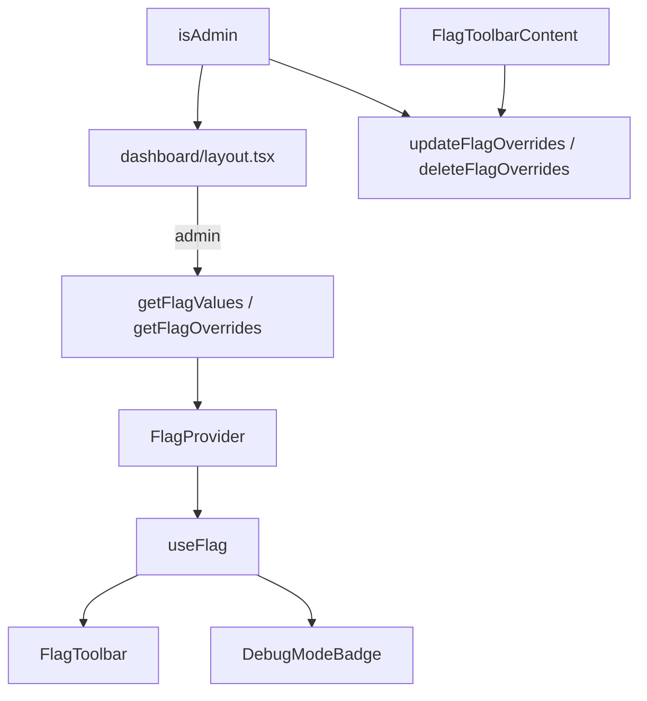

# Feature flags

High-level overview of feature flags and the local `FlagToolbar` in this
template.

## Overview

[Flags SDK](https://flags-sdk.dev/) (`flags` package) defines boolean flags
with server-side `decide()` defaults. `FlagToolbar` lets admins override
values without redeploying via an encrypted cookie.

- Flag declarations live in `src/lib/flags/config.ts`.
- Initialized flag instances live in `src/lib/flags/index.ts`.
- The dashboard layout evaluates flags on the server for admins and passes
  `values` / `overrides` into `FlagProvider`.
- `FlagToolbar` mounts on dashboard routes when `isAdmin` allows the
  signed-in user (always in development; allowlisted emails in
  preview/production).
- `DebugModeBadge` renders a compact indigo **Debug** capsule at the
  bottom-left of the main content panel when `client-debug` and/or
  `server-debug` resolve to `true`.

## Available flags

| Key            | Export            | Default | Purpose                      |
| -------------- | ----------------- | ------- | ---------------------------- |
| `client-debug` | `clientDebugFlag` | `false` | Enables debug UI             |
| `server-debug` | `serverDebugFlag` | `false` | Enables debug server actions |

Both flags are boolean with Off / On options. Production behavior comes from
each flag's `decide()` until overridden via cookie.

## Flow



## FLAGS_SECRET

Encrypted overrides require `FLAGS_SECRET` — a random secret used by the Flags
SDK.

**Manual (local only):**

```bash
node -e "console.log(require('crypto').randomBytes(32).toString('base64url'))"
```

Add to `.env.local` (see `.env.example`):

```env
FLAGS_SECRET="your-generated-value"
```

Use a **different secret per environment** (local, preview, production).
Do not reuse the same value across dev, preview, and prod.

## Considerations

- Extend flags by adding declarations in `src/lib/flags/config.ts`, creating
  instances in `src/lib/flags/index.ts`, and evaluating them where needed.
