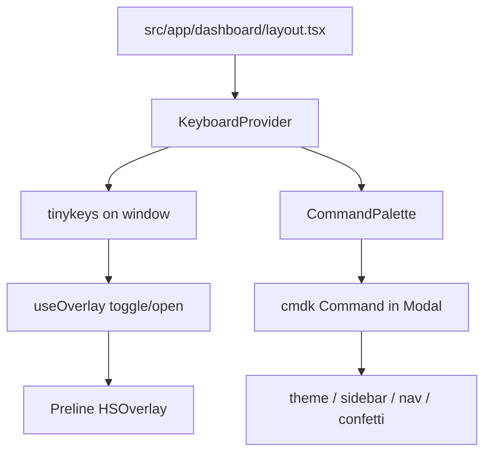

# Keyboard shortcuts

High-level overview of dashboard keyboard shortcuts and the command palette.

## Overview

Dashboard-only shortcuts powered by `tinykeys`, plus a Linear-style action
search built with `cmdk` inside the existing Preline `Modal` overlay:

- Global chords bind on `window` via `KeyboardProvider`.
- `⌘K` / `Ctrl+K` toggles the command palette (always active).
- `/` opens the palette when focus is not in an editable field.
- Palette actions mirror the chord shortcuts where applicable.
- Esc, backdrop click, and overlay close sync back to React state.

## Design choices

| Choice                         | Reason                                              |
| ------------------------------ | --------------------------------------------------- |
| `tinykeys` + `$mod`            | Cross-platform ⌘ / Ctrl without custom key parsing  |
| Preline `Modal`, not Radix     | Reuses existing overlay stack and z-index behavior    |
| Data-only `commands.ts`        | Registry stays serializable; execution lives in UI  |
| `isClosePrev: false` on palette | Opening search does not dismiss the layout sidebar |

## Bindings (dashboard)

| Chord              | Action                                      |
| ------------------ | ------------------------------------------- |
| `⌘K` / `Ctrl+K`    | Toggle command palette                      |
| `/`                | Open palette (non-editable targets only)    |
| `⌘⇧L` / `Ctrl+Shift+L` | Toggle resolved light / dark theme      |
| `⌘B` / `Ctrl+B`    | Toggle sidebar overlay                      |
| `⌘⇧.` / `Ctrl+Shift+.` | Confetti burst                        |

Modifier chords still run while focused in inputs; `/` does not.
Esc closes the palette via Preline (not `tinykeys`).

## Palette actions

- Theme: Light
- Theme: Dark
- Theme: System
- Toggle sidebar
- Go to Home
- Log out
- Confetti

The active theme item shows a check mark via `aria-checked`.

## Flow

`KeyboardProvider` mounts inside `DashboardProviders` on the dashboard layout.
It binds shortcuts, renders `CommandPalette`, and executes shared actions for
both chords and palette selections.

Some relevant details:

- **Registry:** `src/lib/keyboard/commands.ts` lists ids, labels, groups,
  optional chords, and keywords.
- **Editable guard:** `src/lib/keyboard/is-editable-target.ts` blocks `/`
  inside inputs, textareas, selects, and common ARIA text roles.
- **Open-state sync:** `src/hooks/use-overlay-open-state.ts` listens for
  `open.hs.overlay` / `close.hs.overlay` on the palette element.
- **Confetti:** `src/lib/confetti.ts` is shared with login confetti.

## Considerations

- **Scope:** Shortcuts are dashboard-only; marketing and auth pages are
  unchanged.
- **Preline vs cmdk:** Arrow keys and typing stay on cmdk while the palette
  is open; other chords pause except `⌘K` / `Ctrl+K`.
- **Tests:** Existing dashboard layout tests mock navigation hooks as needed;
  no dedicated keyboard shortcut tests in this pass.
