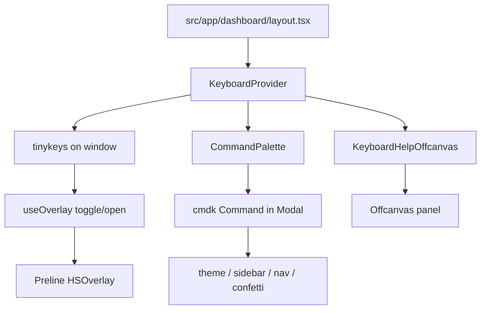

# Keyboard shortcuts

High-level overview of dashboard keyboard shortcuts and the command palette.

## Overview

Dashboard-only shortcuts powered by `tinykeys`, plus a action search built
with `cmdk` inside the existing Preline `Modal` overlay, and a keyboard
shortcuts help panel in a Preline `Offcanvas`:

- Global chords bind on `window` via `KeyboardProvider`.
- `⌘K` / `Ctrl+K` toggles the command palette (always active, including
  inside inputs).
- `/` opens the palette when focus is not in an editable field.
- `⌘/` / `Ctrl+/` opens the keyboard shortcuts help panel.

## Design choices

| Choice              | Reason                                             |
| ------------------- | -------------------------------------------------- |
| `tinykeys` + `$mod` | Cross-platform ⌘ / Ctrl without custom key parsing |
| Preline `Modal`     | Reuses existing overlay stack and z-index behavior |

## Bindings

| Chord                  | Action                                   |
| ---------------------- | ---------------------------------------- |
| `⌘K` / `Ctrl+K`        | Toggle command palette                   |
| `/`                    | Open palette (non-editable targets only) |
| `⌘⇧,` / `Ctrl+Shift+,` | Toggle resolved light / dark theme       |
| `⌘B` / `Ctrl+B`        | Toggle sidebar overlay                   |
| `⌘⇧.` / `Ctrl+Shift+.` | Confetti                                 |
| `⌘⇧/` / `Ctrl+Shift+/` | Open flag toolbar (admin)                |
| `⌘/` / `Ctrl+/`        | Open keyboard shortcuts help panel       |

Only `⌘K` / `Ctrl+K` runs inside editable targets; other chords and `/` do not.
Esc closes the palette and help panel via Preline (not `tinykeys`).
Shortcut labels show Mac or Windows, not both, via `getIsMac`.

## Flow

`KeyboardProvider` wraps dashboard children inside `DashboardProviders` on the
dashboard layout. It binds shortcuts, renders `CommandPalette` and
`KeyboardHelpOffcanvas`, and executes shared actions for both chords and
palette selections.

Some relevant details:

- **Registry:** `src/components/keyboard/config.tsx` lists ids, labels, groups,
  optional chords, keywords, and optional palette `icon` nodes. Chord-only
  commands skip the palette via `inPalette: false`. `getKeyboardCommands`
  attaches `run` in `KeyboardProvider`.

## Considerations

- **Scope:** Shortcuts are dashboard-only; marketing and auth pages are
  unchanged.
- **Preline vs cmdk:** Arrow keys and typing stay on cmdk while the palette
  is open; other chords pause except `⌘K` / `Ctrl+K`.
