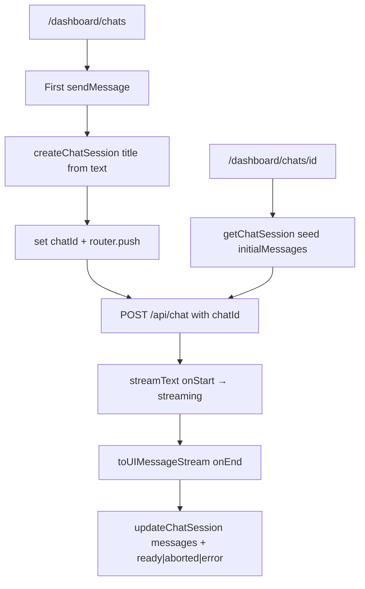

# RNT-42: Save chat session on db

Persist chat sessions in root-next-template, shipped in three priority
slices: P0 schema only, P1 create/update/list/get + routes/sidebar, P2
enhancements (favorite/delete/tooltips).

Mirror sidebar/CRUD UX from `spentor-app`.

## Branches

Three stacked branches (each PR targets the previous base):

| Priority | Branch | Base |
|----------|--------|------|
| P0 | `brandon-cercedo/rnt-42-p0-chat-session-schema` | `main` |
| P1 | `brandon-cercedo/rnt-42-p1-chat-session-persist` | P0 branch |
| P2 | `brandon-cercedo/rnt-42-p2-chat-session-enhancements` | P1 branch |

Merge order: P0 → P1 → P2. After P0 lands on `main`, retarget P1’s PR to `main`; same for P2 after P1 merges.

## Conventions

- Prisma model: `ChatSession`; vars/consts/props: `chatId`
- Index: only `@@index([userId, updatedAt])` (no standalone `userId`)
- No React component tests

## Current state

- P1 persistence is in place: `/dashboard/chats`, sidebar CHATS,
  `createChatSession`, and `POST /api/chat` status lifecycle
  (`streaming` → `ready` | `aborted` | `error`).
- `submitted` remains the schema default / unused app write path.
- P2 enhancements (favorite/delete/tooltips) still open.

## Checklist

### P0

- [x] ChatSession model, PrismaJson type, migrate (composite index only)

### P1

- [x] DB helpers + feature actions create/get/list/update; FullUser.chatSessions
- [x] chatId in request; server metadata; onStart/onEnd status; drop client composition
- [x] `/dashboard/chats` + `/dashboard/chats/[id]`; move ChatSection; empty home
- [x] New chat item + CHATS section (list/hide/Plus); no dropdown yet
- [x] Schema/action/API tests only; update `docs/chatbot.md`
- [x] `ChatSessionStatus.aborted`; persist `streaming` / `ready` / `aborted` / `error`

### P2

- [ ] `deleteChatSession` + `toggleFavoriteChatSession` actions
- [ ] Settings dropdown (Favorite, Copy link, Delete); Favorites section wiring
- [ ] createdAt above chat; updatedAt tooltip with duration + message counts

---

## P0 — Database schema only

Add to `prisma/schema.prisma` and wire `User.chatSessions`:

```prisma
enum ChatSessionStatus {
  submitted
  streaming
  ready
  error
  aborted
}

model ChatSession {
  id          String            @id @default(uuid(7))
  title       String
  status      ChatSessionStatus @default(submitted)
  error       String?
  /// [ChatUIMessageType[]]
  messages    Json              @default("[]")
  isFavourite Boolean           @default(false)
  createdAt   DateTime          @default(now())
  updatedAt   DateTime          @updatedAt
  userId      String
  user        User              @relation(fields: [userId], references: [id], onDelete: Cascade)

  @@index([userId, updatedAt])
}
```

- Add `PrismaJson` chat message type in `prisma/types.ts`.
- Migrate + regenerate client.
- No app code, actions, or UI in this slice.

---

## P1 — Create, update, list, get

Core persistence so refresh/return keeps history.

### Mutations (P1 only)

| Action | Behavior |
|--------|----------|
| `createChatSession({ title })` | Auth, Zod, return `{ id }`, revalidate |
| `getChatSession({ id })` | Owner-only; else null/notFound |
| `listChatSessions()` | Current user, `updatedAt` desc |
| `updateChatSession({ id, ... })` | Auth, Zod, revalidate |

- DB layer: `src/services/chat-session.ts`
- Feature: `src/features/chat/actions.ts`
- Load `chatSessions` on `FullUser` via `src/actions/db/user.ts`

### Create / update flow



1. Create on first send: title from user text; keep `chatId` in state;
   `router.push` (live `Chat` reused); pass `chatId` in transport body.
   Create writes `status: "ready"` with the first user message.
2. Update in `src/app/api/chat/route.ts`:
   - `streamText.onStart` → `status: "streaming"` (+ revalidate)
   - `streamText.onError` → `hasError` flag (log; do not persist alone)
   - `toUIMessageStream({ originalMessages, messageMetadata, onEnd })`
     → messages + terminal `ready` | `aborted` | `error`
3. Extend `src/features/chat/schema/chat.ts` with `chatId`.
4. Drop client metadata composition; stamp timestamps on server.

### Routes

| Path | Behavior |
|------|----------|
| `/dashboard/chats` | New empty chat (no DB row until first send) |
| `/dashboard/chats/[id]` | Load session; seed `initialMessages`; 404 if not owner |
| `/dashboard` | Remove `ChatSection`; empty home |

- Paths: `dashboard.chats()`, `dashboard.chat(id)` in
  `src/lib/config/paths.ts`.

### Sidebar (list only)

Update `src/components/layout/sidebar/config.tsx` to take `user`:

1. After Home: **New chat** → `/dashboard/chats`
2. After Favorites: **CHATS** group — truncated titles,
   `/dashboard/chats/<id>`, Plus → `/dashboard/chats`, **hide group when
   empty**
3. No settings dropdown yet (P2)

### Tests & docs (P1)

- Tests for Zod + create/get/list/update actions + API persistence
  (`chatId`, `onStart` streaming, `onEnd` ready/aborted/error,
  `onError` → error). No React component tests.
- Update `docs/chatbot.md` for chats routes and persistence.

---

## P2 — Enhancements

Polish on top of a working P1.

### Mutations

| Action | Behavior |
|--------|----------|
| `deleteChatSession({ id })` | Owner-only; revalidate |
| `toggleFavoriteChatSession({ id, isFavourite })` | Owner-only; revalidate |

### UI

- Sidebar item **settings dropdown** (mirror spentor
  `PageConfigDropdown`): Delete, Favorite, Copy link.
- **Favorites** section: replace stub with favorited chats; hide when
  empty.
- Above `ChatSection`: show `createdAt`.
- **updatedAt tooltip** (mirror `PageUpdatedTooltip`): total duration +
  user vs assistant message counts.

### Tests (P2)

- Action tests for delete + favorite only. Still no React component
  tests.

---

## Out of scope

- RNT-40 (sidebar chat panel), RNT-52 (edit/retry/fork)
- Soft-trash / nested chats
