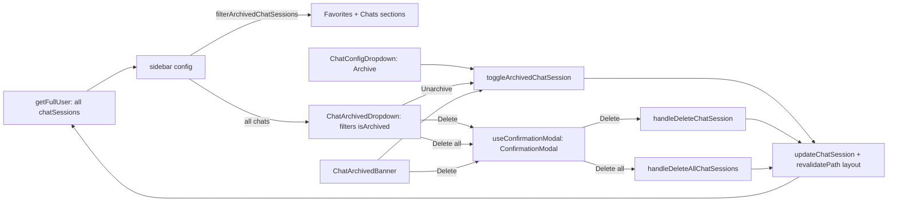

# RNT-87: Archive chats

Archive and unarchive chats in root-next-template, shipped in two
priority slices: P0 schema only, P1 archive feature (actions, API guard,
sidebar, banner).

Mirror the trash UX from `spentor-app` (`inTrash` + `trashedAt`,
`PageTrashButton`, `DashboardTrashLink`, `PageTrashBanner`), using
Archive wording instead of Trash.

## Branches

Two stacked branches (the P1 PR targets the P0 branch):

| Priority | Branch                                           | Base      |
| -------- | ------------------------------------------------ | --------- |
| P0       | `brandon-cercedo/rnt-87-p0-chat-session-archive` | `main`    |
| P1       | `brandon-cercedo/rnt-87-p1-archive-chats`        | P0 branch |

Merge order: P0 → P1. After P0 lands on `main`, retarget P1's PR to
`main`.

## Conventions

- Archive state: `isArchived` flag + `archivedAt` timestamp, set
  together (mirrors `inTrash` + `trashedAt`).
- `ChatSessionStatus` stays the streaming lifecycle. `archived` does not
  go there, because the stream resets status to `ready`.
- Read `chat.isArchived` directly; no `isChatArchived` helper.
- Filter archived chats on the client (mirrors `filterTrashedPages`).
  `listChatSessions` and `getFullUser` stay unchanged.
- No index or seed changes.
- No React component tests.

## Checklist

### P0

- [x] `isArchived` + `archivedAt` on `ChatSession`, migrate, regenerate

### P1

- [x] `filterArchivedChatSessions` chat feature helper
- [x] `toggleArchivedChatSession` action; 403 in `POST /api/chat`
- [x] `ChatArchiveButton` + `ChatRestoreButton`; replace Delete with
      Archive in the config dropdown
- [x] `ChatArchivedDropdown` + conditional Archived sidebar item
- [x] Filter archived chats out of Favorites and Chats sections
- [x] `ChatArchivedBanner`; read-only chat view when archived
- [x] "Delete all" in `ChatArchivedDropdown`: `ChatDeleteAllButton`;
      `handleDeleteAllChatSessions` action + `deleteAllChatSessions`
      service (`deleteMany`)
- [x] Shared `ConfirmationModalProvider` + `useConfirmationModal` +
      `ConfirmationModal`; `ChatDeleteButton` and `ChatDeleteAllButton`
      confirm through it (replaces `ChatDeleteModal`;
      `ChatSessionProvider` and `OverlayAction` kept for now)
- [x] Helper, action, service, hook and API tests; `pnpm test:all`

---

## P0 — Database schema only

Add to `ChatSession` in `prisma/schema.prisma`:

```prisma
isArchived  Boolean   @default(false)
archivedAt  DateTime?
```

- Keep the existing `@@index([userId, lastMessageAt])`; nothing queries
  by archive state.
- Run `pnpm migrate --name add_chat_session_archive`. This regenerates
  the client and `prisma/utils/fake-data.ts`.
- No app code, actions, or UI in this slice.

---

## P1 — Archive feature



### Helper

In `src/features/chat/utils.ts`, next to the other chat helpers:

```ts
export function filterArchivedChatSessions(chats: ChatSession[]) {
  return chats.filter((chat) => !chat.isArchived);
}
```

### Mutations

| Action                                          | Behavior                                                                      |
| ----------------------------------------------- | ----------------------------------------------------------------------------- |
| `toggleArchivedChatSession({ id, isArchived })` | Owner-only; sets `isArchived` + `archivedAt`; revalidate layout               |
| `handleDeleteAllChatSessions()`                 | Owner-only; `deleteAllChatSessions(userId)` (`deleteMany` where `isArchived`) |

Mirrors `toggleFavoriteChatSession` and spentor `toggleTrashedPage`:

```ts
await updateChatSession({
  id,
  userId: user.id,
  data: {
    isArchived,
    archivedAt: isArchived ? new Date() : null,
  },
});
revalidatePath(paths.dashboard.home(), "layout");
```

### API guard

In `src/app/api/chat/route.ts`, return `403 Forbidden` after the chat
lookup when `chat.isArchived`. The disabled input alone is not enough.

### UI (`src/features/chat/components`)

- **`buttons/ChatArchiveButton.tsx`** (mirror `PageTrashButton`):
  `useTransition` + spinner; `label` and `className` props like
  `ChatDeleteButton`. `LucideArchive`; toast "Chat archived" with Undo.
- **`buttons/ChatRestoreButton.tsx`** (mirror `PageRestoreButton`): same
  shape. `LucideArchiveRestore`; toast "Chat unarchived".
- **`ChatConfigDropdown.tsx`**: replace the `ChatDeleteButton` group
  with `ChatArchiveButton`. Delete is no longer in this menu.
- **`ChatArchivedDropdown.tsx`** (mirror `DashboardTrashLink`): receives
  all chats and filters `chat.isArchived` itself. `Dropdown` popover
  with:
  - search input; empty states "No archived chats" and
    "No matching chats"
  - one row per archived chat: link, title, `humanizeDate(archivedAt)`
    when set
  - inline `ChatRestoreButton` and `ChatDeleteButton`
  - footer `ChatDeleteAllButton` (red, receives the archived chats;
    disabled when empty)
- **`buttons/ChatDeleteButton.tsx`** and
  **`buttons/ChatDeleteAllButton.tsx`**: call `openConfirmation` from
  `useConfirmationModal` with a title, message and a
  `confirmButton.handler` that runs the delete action, toasts, and
  redirects to `/dashboard/chats` when the open chat was deleted.
- **Shared confirmation** (`src/hooks/use-confirmation-modal.tsx` +
  `src/components/ui/modal/ConfirmationModal.tsx`):
  `ConfirmationModalProvider` wraps the dashboard providers and
  `ConfirmationModal` is mounted once in the dashboard layout. Options:
  `{ title, message, closeButton?, confirmButton? }`; each button takes
  `{ label?, handler?, className? }` (sync or async handler). The hook
  returns `{ options, openConfirmation, handleConfirm, handleCancel }`;
  the modal closes after the handler resolves. Replaces
  `ChatDeleteModal`; `ChatSessionProvider` and `OverlayAction` are kept
  for now.
- **`ChatArchivedBanner.tsx`** (mirror `PageTrashBanner`): takes
  `{ chat, user }` because chats do not load an `owner`; `user` comes
  from `useUser()` in `ChatView`. Button classes are written inline.

```tsx
export default function ChatArchivedBanner({
  chat,
  user,
}: ChatArchivedBannerProps) {
  if (!chat.isArchived) {
    return null;
  }

  const ownerName = composeUserDisplayName(user);
  const archivedAtText = chat.archivedAt
    ? humanizeDate(chat.archivedAt)
    : "recently";
  const archivedText = `${ownerName} archived this chat ${archivedAtText}.`;

  return (
    <div
      className="w-full bg-red-500 p-2 text-sm text-white"
      role="alert"
      tabIndex={-1}
      aria-labelledby="chat-archived-banner"
    >
      <div className="flex items-center justify-center gap-4">
        <div>{archivedText}</div>
        <div className="flex items-center gap-2">
          <ChatRestoreButton
            chat={chat}
            label="Unarchive"
            className="size-auto border border-white px-2 py-1 text-[13px] leading-5 text-nowrap text-white hover:bg-red-600 hover:text-white focus:bg-red-600 focus:text-white dark:border-white dark:text-white dark:hover:bg-red-600 dark:hover:text-white dark:focus:bg-red-600 dark:focus:text-white"
          />
          <ChatDeleteButton
            chat={chat}
            label="Delete permanently"
            className="size-auto border border-white px-2 py-1 text-[13px] leading-5 text-nowrap text-white hover:bg-red-600 hover:text-white focus:bg-red-600 focus:text-white dark:border-white dark:text-white dark:hover:bg-red-600 dark:hover:text-white dark:focus:bg-red-600 dark:focus:text-white"
          />
        </div>
      </div>
    </div>
  );
}
```

- **`ChatSection.tsx`**: pass
  `disabled={isLoading || Boolean(chat?.isArchived)}` to `ChatInput`.

### Page composition (app layer)

`src/app/dashboard/_components/sidebar/config.tsx`:

1. `getSidebarSections` computes
   `filterArchivedChatSessions(user.chatSessions)` and passes it to
   `getFavoritesSection` and `getChatsSection`. Archived favorites keep
   `isFavourite: true` and return to Favorites when unarchived.
2. `getTopSection` receives `user.chatSessions`. When
   `chatSessions.some((chat) => chat.isArchived)`, add an **Archived**
   item whose `renderLink` renders `ChatArchivedDropdown` (mirrors
   spentor `hasTrash`).

`src/app/dashboard/chats/_components/ChatView.tsx`, when
`chat.isArchived`:

- render `<ChatArchivedBanner chat={chat} user={user} />` between
  `Navbar` and `DashboardPageContainer` (full width above content)
- hide the favorite button and the config dropdown in the navbar

### Tests (P1)

No React component tests.

- `src/features/chat/__tests__/utils.test.ts`:
  `filterArchivedChatSessions` removes archived chats, returns `[]` when
  all are archived, and returns the list unchanged when none are.
- `src/features/chat/__tests__/actions.archive.test.ts`:
  - `toggleArchivedChatSession` for archive
    (`{ isArchived: true, archivedAt: Date }`), unarchive
    (`{ isArchived: false, archivedAt: null }`), unauthenticated, and a
    thrown error.
  - `handleDeleteAllChatSessions` for success, unauthenticated, and a
    thrown error.
- `src/services/__tests__/chat-session.test.ts`:
  `deleteAllChatSessions` calls `deleteMany` with
  `{ userId, isArchived: true }`.
- `src/hooks/__tests__/use-confirmation-modal.test.tsx`: throws outside
  the provider; `openConfirmation` stores options and opens the overlay;
  `handleConfirm` awaits the async handler before closing;
  `handleCancel` runs the sync handler and closes; both close without
  handlers.
- `src/app/api/chat/__tests__`: archived chat returns 403.
- Layout test: mock `ChatArchivedDropdown`; `ChatDeleteModal` mock
  removed. `getFullUser` tests need no changes.
- Finish with `pnpm test:all`, `pnpm type:check` and `pnpm lint`.

---

## Out of scope

- Seed data for archived chats
- Server-side filtering of archived chats
- RNT-85 (command palette chat search): `user.chatSessions` still
  includes archived chats. The palette is shared code and cannot import
  from features, so the app layer must pass it chats already filtered
  with `filterArchivedChatSessions`
