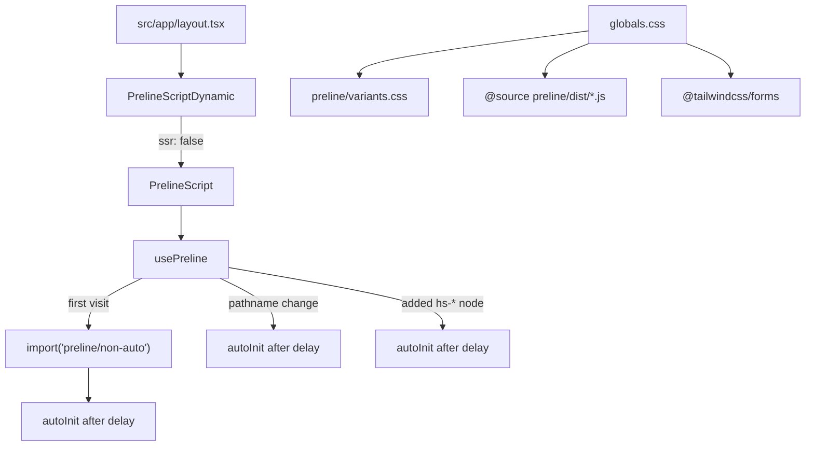

# Preline UI

High-level overview of Preline UI in this template.

## Overview

Client-side components with Preline UI, Tailwind CSS v4, and Next.js App Router:

- `preline/non-auto` for interactive components (dropdowns, overlays, etc.).
- Tailwind forms plugin and Preline variants for component styles.
- Dynamic client-only script so Preline never runs during SSR.

Styles come from `globals.css`. Behavior is loaded once in the browser via the
`usePreline` hook. It scans the DOM after import, again when the route changes,
and when new plugin roots are added after first mount.

## Design choices

| Choice                         | Reason                                                             |
| ------------------------------ | ------------------------------------------------------------------ |
| Preline v4                     | Matches Tailwind v4 / official Next.js install path                |
| `preline/non-auto`             | Named classes without `window` globals or `load` listeners         |
| Client-only dynamic import     | Preline needs `window`; SSR would break or hydrate poorly          |
| Root-layout `PrelineScript`    | One init path for the whole app; pages stay free of boilerplate    |
| `usePreline` + pathname effect | App Router does not remount the layout; route changes need re-init |
| MutationObserver               | Registers `hs-*` nodes added after first mount (portals, flags)    |
| Delayed `autoInit` (~100ms)    | Give the new route DOM time to paint before scanning               |

## Flow

The root layout mounts the `PrelineScriptDynamic` component, which calls the
`usePreline` hook. It loads `preline/non-auto` once, then calls
`HSStaticMethods.autoInit()` after import, on each pathname change, and when
new plugin roots appear in the DOM.

Some relevant details:

- **Styles:** `src/app/globals.css` imports Preline variants, scans Preline
  JS for class names, and enables `@tailwindcss/forms`.
- **Lookups:** `useOverlay` / `useDropdown` call `HSOverlay.getInstance` /
  `HSDropdown.getInstance` on the imported class, not `window`. They retry
  while a portal or conditional overlay is still mounting.

## Considerations

- **Initializing:**
  - First paint is covered by `autoInit` after the import. The observer does
    not see nodes that already exist.
  - Call `init()` (or `init(["dropdown", "overlay"])`) after client-only
    DOM inserts if you need an immediate scan.
  - Same-tick `open(id)` still needs the overlay retry; `autoInit` cannot
    register a node that is not in the document yet.
