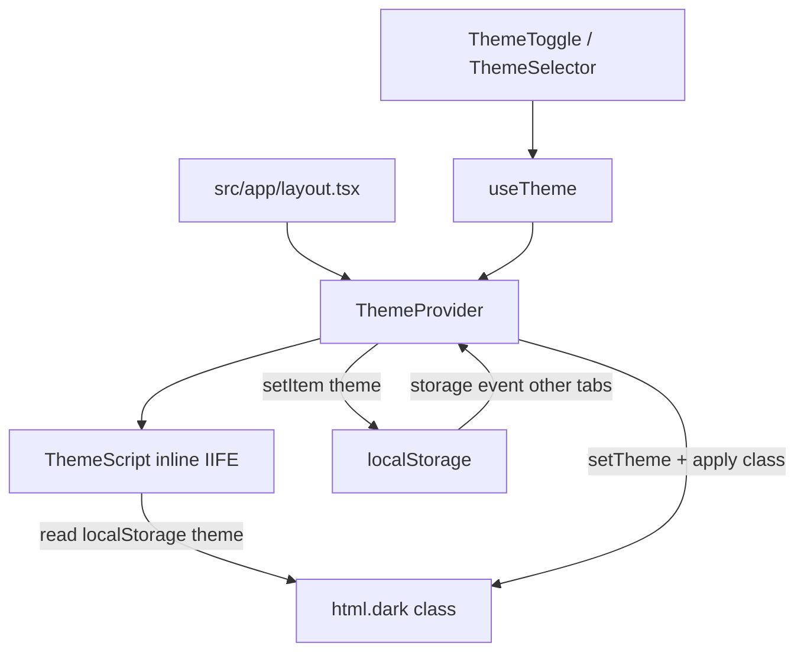

# Theme

High-level overview of light / dark / system theme in this template.

## Overview

Custom theme switching (not Preline's `HSThemeSwitch`):

- Custom `ThemeProvider` + `useTheme` for preference state.
- `localStorage` key `"theme"` (`light` | `dark` | `system`).
- Tailwind `dark:` variants via `.dark` on `<html>`.
- Inline `ThemeScript` to apply the theme before paint (FOUC guard).
- `storage` events keep open tabs in sync.
- UI components: `ThemeToggle` and `ThemeSelector`.

## Design choices

| Choice                 | Reason                                               |
| ---------------------- | ---------------------------------------------------- |
| Custom provider        | Matches prior app pattern; no third-party dependency |
| Blocking `ThemeScript` | Avoids flash of wrong theme on SSR/SSG loads         |

## Flow

The root layout wraps the app in `ThemeProvider`. On the client, `theme` state
drives the `dark` class and `localStorage` persistence. Also, before React hydrates,
`ThemeScript` injects a small IIFE that reads the stored key and sets the class.

Some relevant details:

- **CSS:** `src/app/globals.css` enables  
  `@custom-variant dark (&:where(.dark, .dark *));` and sets dark CSS variables on
  `.dark`.
- **Provider:** `src/hooks/use-theme.tsx` handles `theme`, resolves `color`, listens to
  `matchMedia` changes, and cross-tab `storage` events.
- **FOUC script:** `src/components/theme/ThemeScript.tsx` contains nested helpers inside
  `initTheme` to ensure serialization stays self-contained (same approach as
  [next-themes](https://github.com/pacocoursey/next-themes)).

## Considerations

- **Tests:** Vitest mocks `localStorage` / `matchMedia` in `src/testing/setup.ts`
  so theme and FOUC scripts run under jsdom.
